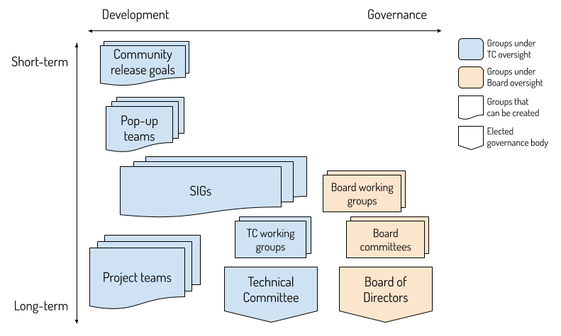

=======================================
Comparison of Official Group Structures
=======================================

This document aims to compare the various official work groups we have in
OpenStack, and explain the difference between a community goal, project team,
SIG (special interest group), working group, pop-up teams... If you are still
unsure, even after you read through this document, please raise your question
on the `mailing-list`_ or on IRC: #openstack-tc so people might be able to
help you.

Groups can be organized around two axis: whether they address a long-term or
short-term mission, and whether that mission is more around development or
governance. Missions in OpenStack are either under the oversight of the Board
of Directors (trademark, Foundation affairs) or the Technical Committee
(open source project).

Project teams
=============

:doc:`Project teams </reference/projects/index>` are responsible for producing
the "OpenStack" software releases. They are either producing a specific subset
of OpenStack deliverables (like Compute service deliverables), or provide
functions that are integral to the production of the software (like Release
management or QA).

Project teams are under the oversight of the TC, and traditionally lead by PTLs
(project team leaders). Since their collective output is assembled to make the
"OpenStack" coordinated releases every 6 months, extra accountability is
required of project teams to make OpenStack as a whole reach high quality
standards. In particular, we require named liaisons for deliverable release
management, security vulnerability management, and QA/CI infrastructure
liaison.

Beyond that, project teams own git repositories, review proposed code changes,
manage bug reports, answer questions on the mailing-list, define the future
roadmap for their deliverables, and help communicate recent changes. To that
effect, team members hold regular team meetings and participate in various
community events.

OpenStack has a large number of existing project teams. if you would like to
create a new project team, you can reference
:doc:`new projects requirements </reference/new-projects-requirements>`
documentations for more details.

Special Interest Groups (SIGs)
==============================

`SIGs`_ are groups with a long-term mission, but which are not directly
responsible for producing components of the "OpenStack" software release.
They usually gather like-minded individuals that want to advance a specific
facet of OpenStack (like usage of OpenStack in scientific communities) that
extends beyond a limited set of code repositories. They generally regroup
developers, operators and end users interested in the same topics. Some of
those topics are very development oriented (like enabling support for multiple
architectures), while some others are more governance-oriented (like helping
first-time contributors).

SIGs are under the oversight of the TC, and traditionally lead by a number of
co-leads. Since they are not directly in charge of producing OpenStack, only
limited accountability is required, and SIGs do not have any required named
liaisons.

SIGs can own git repositories and produce software, but that software will be
considered add-on software to the main "OpenStack" software releases. Therefore
SIGs deliverables are not part of the coordinated release, and will not leverage
the openstack/releases repository. If a SIG does release any tooling or software
they are responsible for any release management/tagging needed.

You can check for `process to create a SIG`_ for creating a new SIG.

Pop-up teams
============

Pop-up teams are lightweight structures aiming to provide quick start for short
term (time-limited) cross-project mission. In particular, pop-up teams should
have a disband criteria: an end status goal at which point the pop-up team
should be disbanded. These cross-project and time-limited aspects are what
differentiates them from Project teams or SIGs.

Pop-up teams are under the oversight of the TC, and traditionally lead by a
number of co-leads. Since they are not directly in charge of producing
OpenStack, only limited accountability is required, and pop-up teams do
not have any required named liaisons.

Pop-up teams do not own code repositories, they usually work on code
repositories from existing project teams to reach their goals.

You can read more about the process to create a pop-up team in
:doc:`popup team guideline </reference/popup-teams>`
if you consider to create one.

Community goals
===============

:doc:`Community goals </goals/index>` are per-release objectives, set by the
Technical Committee for all project teams. Those are used to achieve
user-visible common changes, push for basic levels of consistency and user
experience, and efficiently improve certain areas which suffer from technical
debt. The main difference with pop-up teams is that it's a time-limited scope
rather than an objective-limited scope, and they generally aim at affecting
all project teams rather than a limited set of them.

Community goals are driven by goal champions and executed in each project team.
They do not require specific git repositories or deliverables.

If you have an improvement which affects projects OpenStack-wide, then you
can propose it as a community goal. The Technical Committee will be
responsible for selecting :doc:`community goal </goals/index>` for each cycle.

Technical Committee and TC working groups
=========================================

The `Technical Committee (TC)`_ is an elected governance body, representing all
contributors to the open source project.

It may delegate rights (and duties) to `TC working groups`_ (like the Election
officials which have a delegation for running elections).

The TC owns git repositories (generally around governance documents) but does
not produce OpenStack deliverables by itself.

Board of Directors, Board committees and working groups
=======================================================

The Foundation `Board of Directors`_ is a governance body, representing all
Foundation members. It is composed of three tiers: Platinum representatives
(selected by each Platinum member), Gold representatives (elected among the
Gold members), and Independent representatives (elected by all the individual
members of the Foundation).

The Board of Directors has oversight over the Foundation, whose mission is to
develop, support, protect, and promote OpenStack and other Open Infrastructure
projects.

It may delegate rights (and duties) to Board `committees and working groups`_,
which are usually staffed by directors themselves.

.. _mailing-list: http://lists.openstack.org/cgi-bin/mailman/listinfo/openstack-discuss
.. _SIGs: https://governance.openstack.org/sigs/
.. _process to create a SIG: https://governance.openstack.org/sigs/#process-to-create-a-sig
.. _Technical Committee (TC): https://governance.openstack.org/tc/
.. _TC working groups: https://governance.openstack.org/tc/reference/working-groups.html
.. _Board of Directors: https://www.openstack.org/foundation/board-of-directors/
.. _committees and working groups: https://wiki.openstack.org/wiki/Governance/Foundation#Committees_.26_Working_Groups
